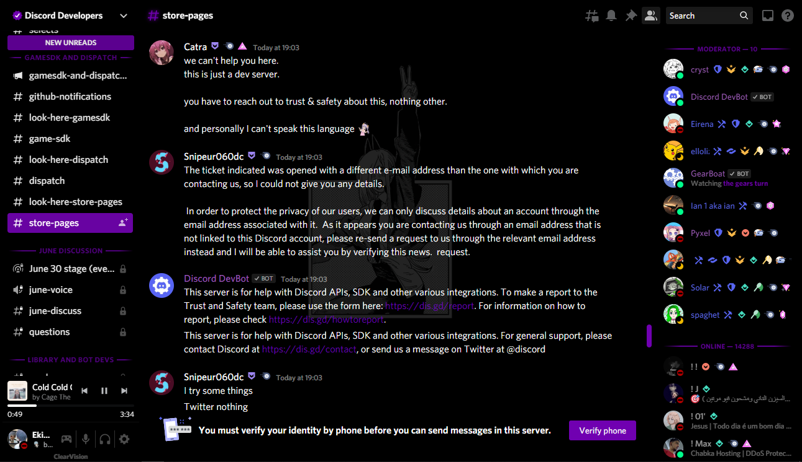
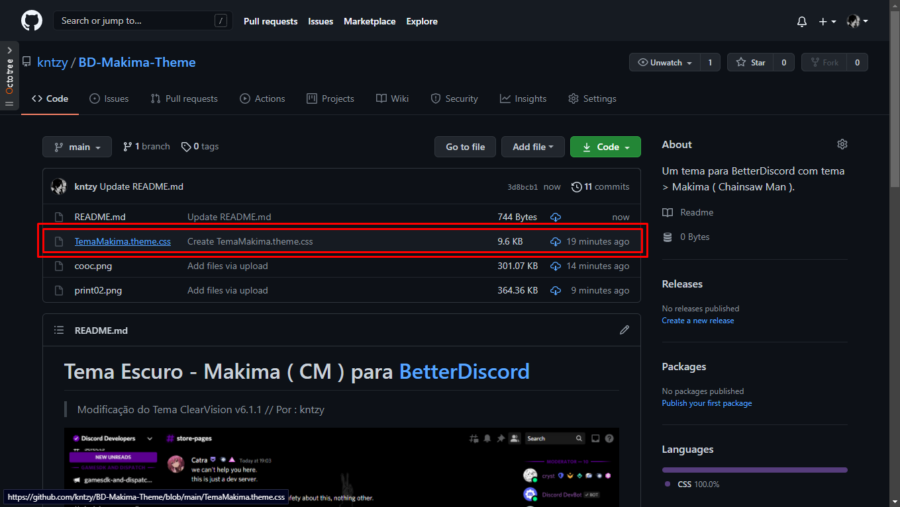

# Tema Escuro - Makima ( CM ) para [BetterDiscord](https://betterdiscord.app)
> Modificação do Tema ClearVision v6.1.1 // Por : kntzy

## Como obter ?

Para obter, primeiro instale o [BetterDiscord](https://betterdiscord.app).

Após isso, salve o meu Tema aqui deste repositório ( TemaMakima.theme.css ).

Após isso, entre no Discord e vá em : Configurações de Usuário -> Themes -> Open Themes Folder
> Lembrando que a Opção Folder só estará disponível no BetterDiscord, portanto baixe-o.

Arraste o arquivo TemaMakima.theme.css para a pasta dos Temas e pronto, ative-o e pronto para usar.

